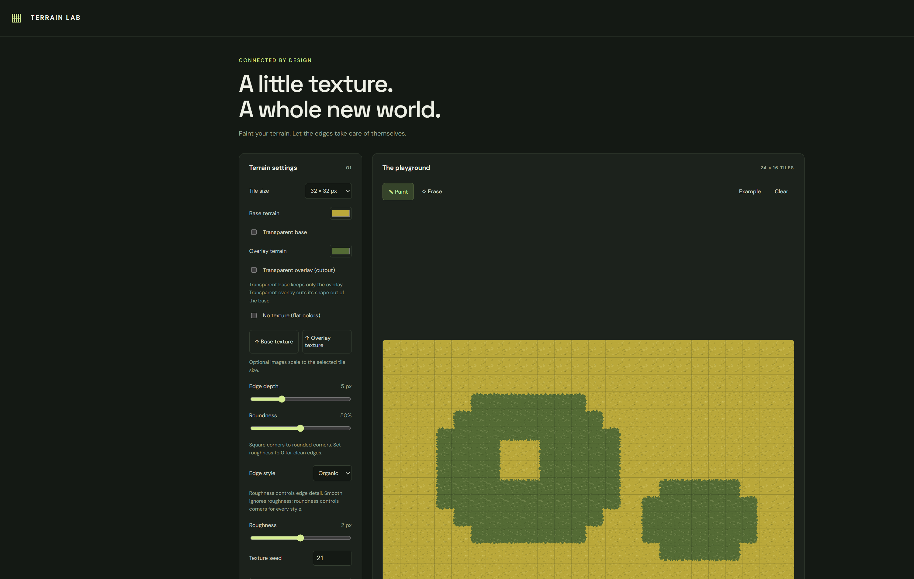

# Terrain Lab

A browser-based pixel terrain editor and autotile atlas generator. Paint a map, customize its edges, and export connected terrain tiles with JSON metadata for your game or tools.



## Features

- **47-variant blob autotiling:** automatic transitions using eight neighbors, including inner corners and diagonal normalization.
- **Interactive map editor:** paint and erase on a 24 × 16 tile map, drag continuous strokes, right-click to erase, restore the example map, or clear the map.
- **Selectable tile sizes:** 8, 16, 24, 32, 48, 64, and 128 pixels. Changing size rebuilds the atlas and scales edge settings while preserving painted cells.
- **Terrain colors:** separate base and overlay color pickers.
- **Procedural textures:** seeded pixel details with a random variation button. The seed also controls organic edge variation.
- **Custom textures:** load separate base and overlay images, scaled to the selected tile size using nearest-neighbor sampling.
- **Flat colors:** disable generated and uploaded textures with the No texture toggle.
- **Transparency:** export only the overlay with a transparent base, or cut the overlay shape out of the base. Enabling both makes terrain tiles transparent.
- **Four edge styles:** organic, smooth, stepped, and jagged.
- **Side effects:** independently choose None, Shadow, or Grass for top, right, bottom, and left exposed overlay edges. Adjust width, shadow color/opacity, and grass color. Effects sit inside the overlay, including inner corners, and appear in terrain PNG exports and JSON metadata. Grass takes priority at overlaps. Masks and transparent cutouts stay unchanged.
- **Shape controls:** adjustable edge depth, roughness, and roundness from square to rounded corners. Smooth edges ignore roughness.
- **Live previews:** map and tile atlas update as settings change; hover atlas tiles to inspect their decimal and hexadecimal neighbor masks.
- **Display options:** toggle the tile grid or preview white alpha masks. Checkerboards indicate transparency without appearing in exports.
- **Atlas PNG export:** 47 tiles in an 8-column × 6-row sheet with one unused transparent slot, no padding, and no spacing.
- **Mask PNG export:** enabling Preview masks exports white shapes on a transparent background instead of colored terrain.
- **Map PNG export:** exports the full map at its actual pixel resolution, without the editing grid. Mask preview also applies to map exports.
- **Atlas JSON export:** dimensions, tile coordinates, neighbor definitions, diagonal rules, all 256 raw-mask lookups, rendering guidance, and current generation settings.
- **Responsive interface:** pixelated canvas rendering and pointer-based painting.
- **Static application:** plain HTML, CSS, and JavaScript; no build step, framework, backend, or package installation. Uploaded textures are processed in the browser.

## Run locally

Open `index.html` in a modern browser, or serve this directory with any static web server.

For XAMPP, place the `terrainlab` directory inside `htdocs`, start Apache, and open:

**[http://localhost/terrainlab/](http://localhost/terrainlab/)**

The stylesheet loads DM Sans and Space Grotesk from Google Fonts when available; local sans-serif fallbacks work offline.

## Usage

1. Choose a tile size and base/overlay colors or upload texture images.
2. Adjust edge style, depth, roughness, and roundness. Set roughness to zero for clean edges.
3. Paint the map to inspect connections. Use Erase or right-click to remove terrain.
4. Enable transparency or Preview masks if needed.
5. Export the atlas PNG and atlas JSON **without changing settings between exports**. Keep the matching files together.

Changing a terrain color clears that layer's uploaded texture. No texture temporarily bypasses both uploaded and generated textures.

## Using the atlas

The exported atlas uses row-major ordering, zero-based indices, and a top-left origin. X increases rightward and Y increases downward. A tile size of `T` produces an atlas of `8T × 6T` pixels and a map of `24T × 16T` pixels. Use nearest-neighbor filtering when drawing tiles.

| Neighbor | Bit |
| --- | --- |
| North | 1 |
| East | 2 |
| South | 4 |
| West | 8 |
| Northeast | 16 |
| Southeast | 32 |
| Southwest | 64 |
| Northwest | 128 |

For an occupied cell, combine the bits for neighbors belonging to the same terrain. Out-of-bounds cells are empty. A diagonal counts only when both adjacent cardinal neighbors are present; the JSON lookup handles this normalization automatically.

```js
// metadata is the parsed atlas JSON; rawMask is an integer from 0 to 255.
const tileIndex = metadata.rawMaskToTileIndex[rawMask];
const tile = metadata.tiles[tileIndex];
ctx.imageSmoothingEnabled = false;
ctx.drawImage(atlasImage,
  tile.x, tile.y, tile.width, tile.height,
  destinationX, destinationY, tile.width, tile.height);
```

The JSON names its matching image: `terrain-atlas.png` or `terrain-masks.png`. Mask pixels are opaque white where the overlay is kept and transparent elsewhere. Mask output is independent of terrain transparency toggles.

Mask `0` represents an isolated **occupied** tile, not an empty map cell. The atlas contains no base-only tile: draw empty cells using your own base terrain, or leave them transparent. Slot 47 is unused.

## Current limitations

- Settings, uploaded images, and map edits are held in memory; refreshing resets them. There is no project save/load or undo/redo yet.
- JSON describes the atlas, not the painted map, and does not embed uploaded source images.
- PNG and JSON download separately; there is no bundled ZIP export.
- The JSON format is custom. Game engines need an importer or integration using the supplied lookup and coordinates.

## Project files

| File | Purpose |
| --- | --- |
| `index.html` | Editor interface |
| `style.css` | Responsive layout and pixel previews |
| `app.js` | Mask generation, painting, rendering, and exports |
| `screenshot.png` | README screenshot |
| `LICENSE` | MIT license |

## License

Released under the [MIT License](LICENSE).
